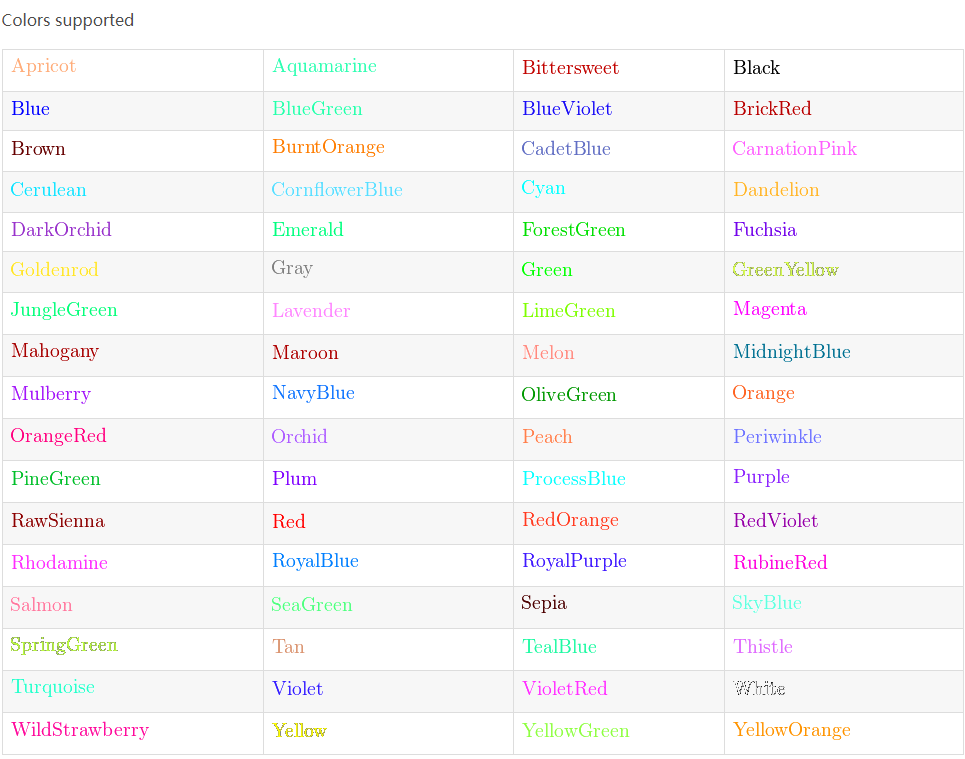

$  {\textcolor{Blue}x^2}+{\textcolor{Brown}2x} -{\color{OliveGreen}1} $:	{\textcolor{Blue}x^2}+{\color{Brown}2x} -{\textcolor{OliveGreen}1}

$ x_{\textcolor{Maroon}1,2}=\frac{-b\pm\sqrt{{\textcolor{Maroon}b^2-4ac}}}{2a}
 $:	 x_{\textcolor{Maroon}1,2}=\frac{-b\pm\sqrt{{\textcolor{Maroon}b^2-4ac}}}{2a}

$$
\textcolor{purple}{
\begin{array}{lcl}
z        & = & a \\
f(x,y,z) & = & x + y + z 
\end{array}
}
$$

$$
\textcolor{green}{
\begin{array}{lcl}
z        & = & a \\
f(x,y,z) & = & \textcolor{red}{x + y + z} 
\end{array}
}
$$